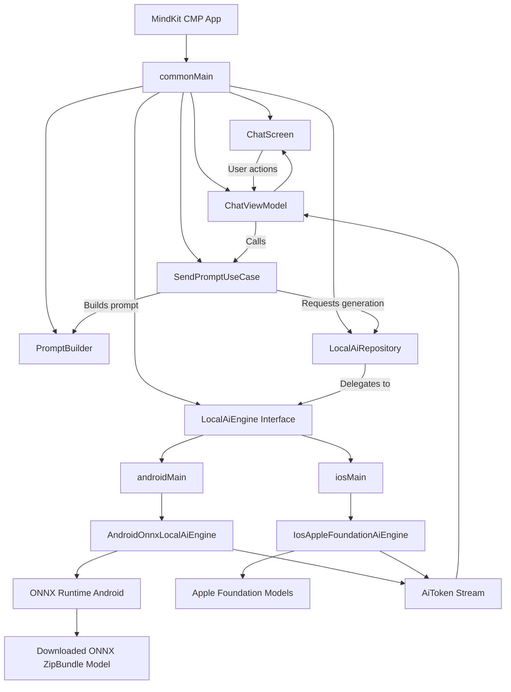
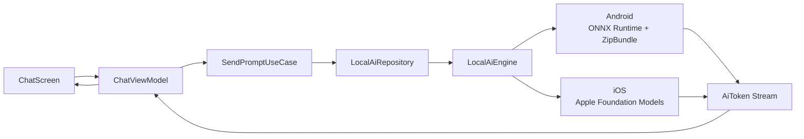

# MindKit CMP MVVM Architecture

## Final Architecture Direction

MindKit is a Compose Multiplatform local AI assistant.

The final platform strategy is:

```text
Android → ONNX Runtime + downloaded ZipBundle model
iOS     → Apple Foundation Models
```

The shared Kotlin code should not know which runtime is used. It should talk only to a common `LocalAiEngine` interface.

---

## 1. Architecture Pattern

Use MVVM.

```text
View → ViewModel → UseCase → Repository → LocalAiEngine → Platform Runtime
```

Use these names:

```text
ChatScreen
ChatViewModel
SendPromptUseCase
LocalAiRepository
LocalAiEngine
```

Do not use Presenter naming.

---

## 2. Platform Strategy



Short version:



---

## 3. Android Model Strategy

Android uses a downloaded ONNX model bundle.

Current default Android model:

```text
Google Gemma 3 270M ONNX
```

Delivery mode:

```text
ZipBundle
```

The model is not shipped with the app.

The app downloads one zip from a direct URL:

```text
https://your-cdn.com/models/gemma-3-270m/gemma-3-270m-onnx.zip
```

No Hugging Face auth is used.

The zip contains the full model folder:

```text
gemma-3-270m-onnx/
├── model.onnx
├── tokenizer.json
├── tokenizer_config.json
├── config.json
├── special_tokens_map.json
├── vocab.json
├── merges.txt
└── model_manifest.json
```

Android download flow:

```text
App starts
↓
Check extracted model folder
↓
If missing, show Model Setup Screen
↓
User taps Download Model
↓
Download zip from direct URL
↓
Verify zip checksum
↓
Extract zip to temp folder
↓
Verify required files
↓
Move extracted folder to final app-private model directory
↓
Load ONNX Runtime
↓
Chat enabled
```

Android final storage:

```text
/data/data/com.mindkit/files/models/google-gemma-3-270m-onnx/
```

---

## 4. iOS Model Strategy

iOS uses Apple Foundation Models.

iOS does not download the Android ONNX zip in the MVP.

iOS flow:

```text
iOS app starts
↓
Check Apple Foundation Models availability
↓
If available, mark Local AI ready
↓
Chat enabled
↓
Prompt goes to Apple Foundation Models
↓
Response streams back to ChatViewModel
```

If Apple Foundation Models are unavailable:

```text
Show unsupported state:
Local AI is not available on this device.
Apple Foundation Models require supported Apple Intelligence device and OS version.
```

iOS engine:

```text
IosAppleFoundationAiEngine
```

It implements the same shared `LocalAiEngine` interface.

---

## 5. Common Rule

`commonMain` owns product behavior.

```text
Chat UI
ViewModels
Use cases
PromptBuilder
Repositories
State models
LocalAiEngine contract
```

Platform code owns runtime behavior.

```text
androidMain → ONNX Runtime + zip model loading
iosMain     → Apple Foundation Models wrapper
```

Do not put ONNX execution logic in commonMain.

Do not put Apple Foundation Models logic in commonMain.

---

## 6. Suggested Package Structure

```text
composeApp/
└── src/
    ├── commonMain/kotlin/com/mindkit/
    │   ├── app/
    │   │   ├── MindKitApp.kt
    │   │   └── AppGraph.kt
    │   │
    │   ├── core/
    │   │   ├── platform/
    │   │   │   ├── LocalAiEngine.kt
    │   │   │   ├── ZipModelDownloader.kt
    │   │   │   ├── ZipExtractor.kt
    │   │   │   ├── ModelFileStorage.kt
    │   │   │   ├── ChecksumValidator.kt
    │   │   │   └── DeviceCapabilityChecker.kt
    │   │   └── design/
    │   │       ├── MindKitTheme.kt
    │   │       ├── MindKitColors.kt
    │   │       └── MindKitTypography.kt
    │   │
    │   ├── feature/
    │   │   ├── chat/
    │   │   │   ├── data/
    │   │   │   │   └── LocalAiRepository.kt
    │   │   │   ├── domain/
    │   │   │   │   ├── AiTaskMode.kt
    │   │   │   │   ├── AiGenerationConfig.kt
    │   │   │   │   ├── AiToken.kt
    │   │   │   │   ├── ChatMessage.kt
    │   │   │   │   ├── PromptBuilder.kt
    │   │   │   │   └── SendPromptUseCase.kt
    │   │   │   └── presentation/
    │   │   │       ├── ChatScreen.kt
    │   │   │       ├── ChatViewModel.kt
    │   │   │       ├── ChatUiState.kt
    │   │   │       └── ChatAction.kt
    │   │   │
    │   │   ├── modeldownload/
    │   │   │   ├── data/
    │   │   │   │   └── ModelDownloadRepository.kt
    │   │   │   ├── domain/
    │   │   │   │   ├── LocalModelManifest.kt
    │   │   │   │   ├── ModelDelivery.kt
    │   │   │   │   ├── ModelRuntime.kt
    │   │   │   │   ├── DefaultModels.kt
    │   │   │   │   └── ModelDownloadState.kt
    │   │   │   └── presentation/
    │   │   │       ├── ModelSetupScreen.kt
    │   │   │       ├── ModelDownloadViewModel.kt
    │   │   │       └── ModelDownloadUiState.kt
    │   │   │
    │   │   └── modelsettings/
    │   │       ├── domain/
    │   │       │   ├── AiEngineInfo.kt
    │   │       │   ├── AiEngineType.kt
    │   │       │   └── ModelState.kt
    │   │       └── presentation/
    │   │           ├── ModelSettingsScreen.kt
    │   │           └── ModelSettingsViewModel.kt
    │   │
    │   └── navigation/
    │       └── AppNavigation.kt
    │
    ├── androidMain/kotlin/com/mindkit/platform/
    │   ├── AndroidOnnxLocalAiEngine.kt
    │   ├── AndroidZipModelDownloader.kt
    │   ├── AndroidZipExtractor.kt
    │   ├── AndroidModelFileStorage.kt
    │   └── AndroidDeviceCapabilityChecker.kt
    │
    └── iosMain/kotlin/com/mindkit/platform/
        ├── IosAppleFoundationAiEngine.kt
        └── IosDeviceCapabilityChecker.kt
```

---

## 7. LocalAiEngine Contract

```kotlin
interface LocalAiEngine {

    suspend fun getEngineInfo(): AiEngineInfo

    suspend fun isAvailable(): Boolean

    suspend fun load(
        manifest: LocalModelManifest
    ): Result<Unit>

    fun generate(
        prompt: String,
        config: AiGenerationConfig
    ): Flow<AiToken>

    suspend fun cancelGeneration()
}
```

Android implementation:

```text
AndroidOnnxLocalAiEngine
```

iOS implementation:

```text
IosAppleFoundationAiEngine
```

---

## 8. Model Runtime and Delivery

```kotlin
enum class ModelRuntime {
    Onnx,
    AppleFoundationModels
}
```

```kotlin
sealed interface ModelDelivery {
    data class ZipBundle(
        val fileName: String,
        val downloadUrl: String,
        val expectedSizeBytes: Long?,
        val checksumSha256: String?
    ) : ModelDelivery

    data object SystemProvided : ModelDelivery
}
```

Android uses:

```text
ModelRuntime.Onnx
ModelDelivery.ZipBundle
```

iOS uses:

```text
ModelRuntime.AppleFoundationModels
ModelDelivery.SystemProvided
```

---

## 9. LocalModelManifest

```kotlin
data class LocalModelManifest(
    val id: String,
    val displayName: String,
    val provider: String,
    val version: String,
    val runtime: ModelRuntime,
    val delivery: ModelDelivery,
    val entryFileName: String,
    val tokenizerFileName: String?,
    val requiredFiles: List<String>,
    val expectedExtractedSizeBytes: Long?,
    val generationDefaults: AiGenerationConfig
)
```

---

## 10. Default Models

```kotlin
object DefaultModels {

    val AndroidGemma3_270M_Onnx = LocalModelManifest(
        id = "google-gemma-3-270m-onnx",
        displayName = "Gemma 3 270M",
        provider = "Google",
        version = "1.0",
        runtime = ModelRuntime.Onnx,
        delivery = ModelDelivery.ZipBundle(
            fileName = "gemma-3-270m-onnx.zip",
            downloadUrl = "https://YOUR_CDN_URL/models/gemma-3-270m/gemma-3-270m-onnx.zip",
            expectedSizeBytes = null,
            checksumSha256 = "TODO_SHA256"
        ),
        entryFileName = "model.onnx",
        tokenizerFileName = "tokenizer.json",
        requiredFiles = listOf(
            "model.onnx",
            "tokenizer.json",
            "tokenizer_config.json",
            "config.json",
            "special_tokens_map.json"
        ),
        expectedExtractedSizeBytes = null,
        generationDefaults = AiGenerationConfig(
            maxNewTokens = 256,
            temperature = 0.7f,
            topP = 0.95f
        )
    )

    val IosAppleFoundationModels = LocalModelManifest(
        id = "apple-foundation-models",
        displayName = "Apple Foundation Models",
        provider = "Apple",
        version = "system",
        runtime = ModelRuntime.AppleFoundationModels,
        delivery = ModelDelivery.SystemProvided,
        entryFileName = "",
        tokenizerFileName = null,
        requiredFiles = emptyList(),
        expectedExtractedSizeBytes = null,
        generationDefaults = AiGenerationConfig(
            maxNewTokens = 256,
            temperature = 0.7f,
            topP = 0.95f
        )
    )
}
```

---

## 11. AiEngineInfo

```kotlin
enum class AiEngineType {
    AndroidOnnx,
    AppleFoundationModels
}
```

```kotlin
data class AiEngineInfo(
    val type: AiEngineType,
    val displayName: String,
    val modelName: String,
    val requiresModelDownload: Boolean,
    val isAvailable: Boolean,
    val statusText: String
)
```

Android example:

```kotlin
AiEngineInfo(
    type = AiEngineType.AndroidOnnx,
    displayName = "ONNX Runtime",
    modelName = "Gemma 3 270M",
    requiresModelDownload = true,
    isAvailable = true,
    statusText = "Running locally with downloaded ONNX model"
)
```

iOS example:

```kotlin
AiEngineInfo(
    type = AiEngineType.AppleFoundationModels,
    displayName = "Apple Foundation Models",
    modelName = "Apple on-device language model",
    requiresModelDownload = false,
    isAvailable = true,
    statusText = "Running locally with Apple Foundation Models"
)
```

---

## 12. Prompt Modes

The chips are not separate screens. They only change the prompt template.

```kotlin
enum class AiTaskMode(
    val title: String,
    val subtitle: String
) {
    QuickAsk("Quick Ask", "Ask anything short"),
    ExplainCode("Explain Code", "Understand code"),
    Summarize("Summarize", "Short summary"),
    RewriteReply("Rewrite Reply", "Improve message")
}
```

Chips visible only when:

```kotlin
messages.isEmpty() && !isGenerating
```

---

## 13. Download State

Used mainly for Android ONNX ZipBundle.

```kotlin
sealed interface ModelDownloadState {
    data object NotDownloaded : ModelDownloadState
    data class DownloadingZip(val progress: Float?) : ModelDownloadState
    data object VerifyingZip : ModelDownloadState
    data class ExtractingZip(val progress: Float?) : ModelDownloadState
    data object VerifyingExtractedFiles : ModelDownloadState
    data class Ready(val modelDirectoryPath: String) : ModelDownloadState
    data class Failed(val reason: String) : ModelDownloadState
}
```

---

## 14. Build Order for Agent

Implement in this order:

```text
1. Create common MVVM package structure.
2. Create LocalAiEngine interface.
3. Create model runtime/delivery/manifest classes.
4. Create DefaultModels:
   - AndroidGemma3_270M_Onnx
   - IosAppleFoundationModels
5. Create PromptBuilder and chat domain models.
6. Create LocalAiRepository and SendPromptUseCase.
7. Create ChatViewModel and ChatScreen.
8. Create Android model download flow:
   - ZipModelDownloader
   - ZipExtractor
   - ModelFileStorage
   - ChecksumValidator
   - ModelDownloadRepository
   - ModelSetupScreen
9. Create fake AndroidOnnxLocalAiEngine.
10. Create fake IosAppleFoundationAiEngine.
11. Wire platform-specific AppGraph:
   - Android active manifest = AndroidGemma3_270M_Onnx
   - iOS active manifest = IosAppleFoundationModels
12. Replace Android fake engine with real ONNX Runtime.
13. Replace iOS fake engine with real Apple Foundation Models wrapper.
```

---

## 15. Acceptance Criteria

The implementation is correct when:

```text
- Android uses ONNX Runtime and downloaded ZipBundle model.
- Android default model is Gemma 3 270M ONNX.
- Android downloads one zip from direct URL.
- Android does not use Hugging Face auth.
- Android does not bundle the model inside the app.
- Android verifies zip and extracted required files.
- iOS uses Apple Foundation Models.
- iOS does not download Android ONNX model in MVP.
- iOS shows unavailable state if Apple Foundation Models are unavailable.
- commonMain talks only to LocalAiEngine.
- Chat UI works on both platforms through same ViewModel and use case.
- Switching Android ONNX model requires only changing the Android manifest and hosted zip.
```

---

## 16. Important Notes

- Android and iOS intentionally use different local AI backends.
- Android is model-agnostic for ONNX ZipBundle models.
- iOS uses Apple Foundation Models as the primary MVP engine.
- Do not put ONNX execution code in commonMain.
- Do not put Apple Foundation Models code in commonMain.
- Keep UI chat-first and minimal.
- Use Material 3 Expressive design.
