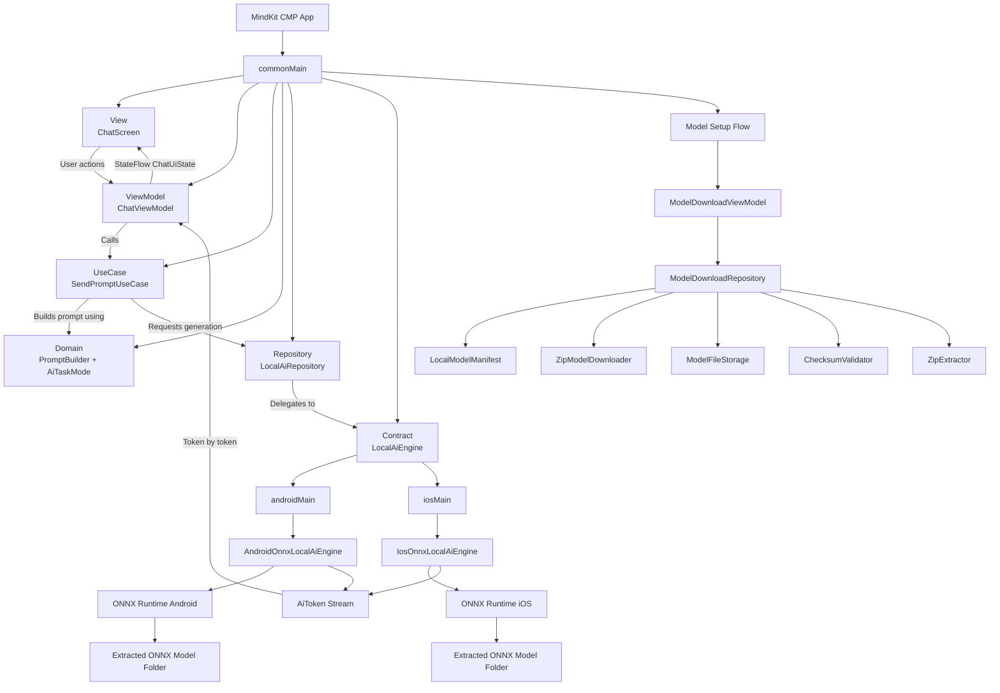
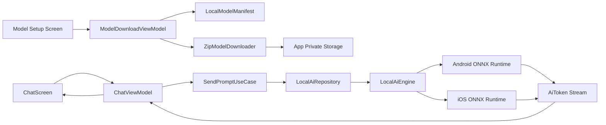

# MindKit CMP MVVM Architecture — ZipBundle ONNX Model Delivery

## 1. Product Direction

MindKit is a private local AI assistant built with Compose Multiplatform.

The app is a clean chat-style local AI interface where the user can optionally select a task chip before sending the first prompt.

Core product idea:

```text
Private AI. On your device.
```

The user sees a simple chat interface with temporary task chips:

- Quick Ask
- Explain Code
- Summarize
- Rewrite Reply

The chips appear only before the user sends the first prompt. Once the user sends a prompt, the chips disappear and the app behaves like a clean chat screen.

---

## 2. Architecture Pattern

Use **MVVM**.

```text
View → ViewModel → UseCase → Repository → LocalAiEngine → Platform Runtime
```

Use:

```text
ChatViewModel
ModelDownloadViewModel
ModelSettingsViewModel
```

Do not use:

```text
ChatPresenter
ModelSettingsPresenter
```

---

## 3. Core Architecture Goal

The architecture must be **model-agnostic for ONNX models**.

Meaning:

```text
The app should support any compatible ONNX model by changing model configuration only.
```

The UI, ViewModel, UseCase, Repository, and common architecture should not be tightly coupled to Gemma, DeepSeek, Qwen, or any specific model.

The current default model is:

```text
Google Gemma 3 270M ONNX
```

But the architecture should allow replacing it with another ONNX model later by changing only the active model manifest.

---

## 4. Locked MVP Model

The current MVP model is:

```text
Model provider: Google
Model family: Gemma 3
Model: Gemma 3 270M
Runtime format: ONNX
Delivery mode: ZipBundle
Download method: Direct URL
Auth required: No
Bundled with app: No
```

Important:

```text
The model must NOT be shipped inside the app bundle.
The app must prompt the user to download the model after installation.
The model must be downloaded from a normal app-controlled direct URL.
The model must be stored in app-private storage.
```

No Hugging Face auth flow is needed in the app.

---

## 5. Model Delivery Strategy: ZipBundle Only

Use **Option A: ZipBundle**.

The developer will provide one hosted zip file containing the complete model folder.

Example URL:

```text
https://your-cdn.com/models/gemma-3-270m/gemma-3-270m-onnx.zip
```

The zip contains all files required by the model.

Example zip content:

```text
gemma-3-270m-onnx/
├── model.onnx
├── tokenizer.json
├── tokenizer_config.json
├── config.json
├── special_tokens_map.json
├── vocab.json
├── merges.txt
└── model_manifest.json
```

The app downloads this one zip file, verifies it, extracts it, verifies required files, and loads the ONNX model from the extracted directory.

Do not download individual files one by one in the MVP.

---

## 6. ZipBundle Download Flow

```text
App starts
↓
Read active LocalModelManifest
↓
Check extracted model folder in app-private storage
↓
Check all required files exist
↓
If missing → show Model Setup Screen
↓
User taps Download Model
↓
Download zip from direct URL
↓
Save zip to temporary app-private location
↓
Verify zip SHA-256 if checksum is configured
↓
Extract zip to temporary extraction folder
↓
Verify required files exist inside extracted folder
↓
Move extracted folder to final model directory
↓
Delete zip/temp files
↓
Mark model as Ready
↓
LocalAiEngine loads model using manifest + extracted directory path
↓
Chat screen becomes usable
```

---

## 7. Final Storage Layout

### Android

Store extracted files in app-private storage:

```text
/data/data/com.mindkit/files/models/google-gemma-3-270m-onnx/
```

Final structure:

```text
files/
└── models/
    └── google-gemma-3-270m-onnx/
        ├── model.onnx
        ├── tokenizer.json
        ├── tokenizer_config.json
        ├── config.json
        ├── special_tokens_map.json
        ├── vocab.json
        └── merges.txt
```

### iOS

Store extracted files in:

```text
Application Support/models/google-gemma-3-270m-onnx/
```

Final structure:

```text
Application Support/
└── models/
    └── google-gemma-3-270m-onnx/
        ├── model.onnx
        ├── tokenizer.json
        ├── tokenizer_config.json
        ├── config.json
        ├── special_tokens_map.json
        ├── vocab.json
        └── merges.txt
```

---

## 8. Model Manifest

Use a manifest-style model config.

The manifest describes the complete model package and lets us swap ONNX models later.

```kotlin
data class LocalModelManifest(
    val id: String,
    val displayName: String,
    val provider: String,
    val version: String,
    val runtime: ModelRuntime,
    val delivery: ModelDelivery,
    val entryFileName: String,
    val tokenizerFileName: String?,
    val requiredFiles: List<String>,
    val expectedExtractedSizeBytes: Long?,
    val generationDefaults: AiGenerationConfig
)

enum class ModelRuntime {
    Onnx
}

sealed interface ModelDelivery {
    data class ZipBundle(
        val fileName: String,
        val downloadUrl: String,
        val expectedSizeBytes: Long?,
        val checksumSha256: String?
    ) : ModelDelivery
}
```

Only `ZipBundle` is used for MVP.

---

## 9. Default Gemma 3 270M Manifest

```kotlin
object DefaultModels {

    val Gemma3_270M_Onnx = LocalModelManifest(
        id = "google-gemma-3-270m-onnx",
        displayName = "Gemma 3 270M",
        provider = "Google",
        version = "1.0",
        runtime = ModelRuntime.Onnx,

        delivery = ModelDelivery.ZipBundle(
            fileName = "gemma-3-270m-onnx.zip",
            downloadUrl = "https://YOUR_CDN_URL/models/gemma-3-270m/gemma-3-270m-onnx.zip",
            expectedSizeBytes = null,
            checksumSha256 = "TODO_SHA256"
        ),

        entryFileName = "model.onnx",
        tokenizerFileName = "tokenizer.json",

        requiredFiles = listOf(
            "model.onnx",
            "tokenizer.json",
            "tokenizer_config.json",
            "config.json",
            "special_tokens_map.json"
        ),

        expectedExtractedSizeBytes = null,

        generationDefaults = AiGenerationConfig(
            maxNewTokens = 256,
            temperature = 0.7f,
            topP = 0.95f
        )
    )
}
```

To switch to another ONNX model later, create a new `LocalModelManifest` and change:

```kotlin
private val activeManifest = DefaultModels.Gemma3_270M_Onnx
```

to:

```kotlin
private val activeManifest = DefaultModels.SomeOtherOnnxModel
```

No UI, ViewModel, UseCase, or Repository architecture should need to change.

---

## 10. High-Level Architecture Diagram



Short version:



---

## 11. App Flow

```text
App starts
↓
Read active LocalModelManifest
↓
Check whether extracted model folder exists
↓
Check required files exist inside extracted folder
↓
If files are missing → Model Setup Screen
↓
User taps Download Model
↓
Download zip from direct URL
↓
Verify zip checksum
↓
Extract zip into temporary folder
↓
Verify required files
↓
Move extracted folder to final model directory
↓
Load model through LocalAiEngine
↓
Open Chat Screen
↓
User selects optional task chip
↓
User sends prompt
↓
Chips disappear
↓
PromptBuilder creates final prompt
↓
LocalAiEngine streams answer
↓
ChatViewModel updates state token by token
↓
ChatScreen recomposes
```

---

## 12. UI Behavior

### Initial Setup State

If model is not downloaded, show setup screen:

```text
Title: Set up local AI
Subtitle: Download Gemma 3 270M to run MindKit offline.
CTA: Download Model
Secondary text: The model is stored only on your device.
```

### Downloading State

Show:

```text
Downloading model...
45%
Wi-Fi recommended
```

### Verifying State

Show:

```text
Verifying model...
```

### Extracting State

Show:

```text
Preparing model...
```

### Ready State

Show:

```text
Local AI ready
```

### Chat State

Show:

- Top app bar
- App title: MindKit
- Status: Local AI ready
- Welcome card
- Task chips
- Bottom input bar

### Before Sending Prompt

Task chips are visible.

```text
[Quick Ask] [Explain Code]
[Summarize] [Rewrite Reply]
```

### After Sending Prompt

Task chips disappear.

The UI shows:

- user message bubble
- assistant response bubble/card
- streaming text
- stop button while generating

### After Clear Chat

Task chips appear again.

---

## 13. Suggested Package Structure

```text
composeApp/
└── src/
    ├── commonMain/
    │   └── kotlin/
    │       └── com/mindkit/
    │           ├── app/
    │           │   ├── MindKitApp.kt
    │           │   └── AppGraph.kt
    │           │
    │           ├── core/
    │           │   ├── design/
    │           │   │   ├── MindKitTheme.kt
    │           │   │   ├── MindKitColors.kt
    │           │   │   └── MindKitTypography.kt
    │           │   │
    │           │   ├── platform/
    │           │   │   ├── LocalAiEngine.kt
    │           │   │   ├── ZipModelDownloader.kt
    │           │   │   ├── ZipExtractor.kt
    │           │   │   ├── ModelFileStorage.kt
    │           │   │   ├── ChecksumValidator.kt
    │           │   │   └── DeviceCapabilityChecker.kt
    │           │   │
    │           │   └── util/
    │           │       ├── AppClock.kt
    │           │       └── IdGenerator.kt
    │           │
    │           ├── feature/
    │           │   ├── chat/
    │           │   │   ├── data/
    │           │   │   │   └── LocalAiRepository.kt
    │           │   │   │
    │           │   │   ├── domain/
    │           │   │   │   ├── AiTaskMode.kt
    │           │   │   │   ├── AiGenerationConfig.kt
    │           │   │   │   ├── AiToken.kt
    │           │   │   │   ├── ChatMessage.kt
    │           │   │   │   ├── PromptBuilder.kt
    │           │   │   │   └── SendPromptUseCase.kt
    │           │   │   │
    │           │   │   └── presentation/
    │           │   │       ├── ChatScreen.kt
    │           │   │       ├── ChatViewModel.kt
    │           │   │       ├── ChatUiState.kt
    │           │   │       ├── ChatAction.kt
    │           │   │       └── components/
    │           │   │           ├── MessageBubble.kt
    │           │   │           ├── PromptInputBar.kt
    │           │   │           ├── TaskChipRow.kt
    │           │   │           ├── WelcomeCard.kt
    │           │   │           └── ModelStatusPill.kt
    │           │   │
    │           │   ├── modeldownload/
    │           │   │   ├── data/
    │           │   │   │   └── ModelDownloadRepository.kt
    │           │   │   │
    │           │   │   ├── domain/
    │           │   │   │   ├── LocalModelManifest.kt
    │           │   │   │   ├── ModelDelivery.kt
    │           │   │   │   ├── ModelRuntime.kt
    │           │   │   │   ├── ModelDownloadState.kt
    │           │   │   │   ├── DefaultModels.kt
    │           │   │   │   ├── CheckModelAvailabilityUseCase.kt
    │           │   │   │   └── DownloadModelUseCase.kt
    │           │   │   │
    │           │   │   └── presentation/
    │           │   │       ├── ModelSetupScreen.kt
    │           │   │       ├── ModelDownloadViewModel.kt
    │           │   │       ├── ModelDownloadUiState.kt
    │           │   │       └── ModelDownloadAction.kt
    │           │   │
    │           │   └── modelsettings/
    │           │       ├── domain/
    │           │       │   ├── AiEngineInfo.kt
    │           │       │   ├── AiEngineType.kt
    │           │       │   ├── ModelInfo.kt
    │           │       │   └── ModelState.kt
    │           │       │
    │           │       └── presentation/
    │           │           ├── ModelSettingsScreen.kt
    │           │           ├── ModelSettingsViewModel.kt
    │           │           └── ModelSettingsUiState.kt
    │           │
    │           └── navigation/
    │               ├── AppRoute.kt
    │               └── AppNavigation.kt
    │
    ├── androidMain/
    │   └── kotlin/
    │       └── com/mindkit/platform/
    │           ├── AndroidOnnxLocalAiEngine.kt
    │           ├── AndroidZipModelDownloader.kt
    │           ├── AndroidZipExtractor.kt
    │           ├── AndroidModelFileStorage.kt
    │           └── AndroidDeviceCapabilityChecker.kt
    │
    └── iosMain/
        └── kotlin/
            └── com/mindkit/platform/
                ├── IosOnnxLocalAiEngine.kt
                ├── IosZipModelDownloader.kt
                ├── IosZipExtractor.kt
                ├── IosModelFileStorage.kt
                └── IosDeviceCapabilityChecker.kt
```

---

## 14. MVVM Responsibilities

### View

Files:

```text
ChatScreen.kt
ModelSetupScreen.kt
ModelSettingsScreen.kt
```

Responsibilities:

- Render UI from state.
- Send actions to ViewModel.
- Do not contain business logic.
- Do not call AI engine directly.
- Do not build prompts.
- Do not manually manage model zip/extraction/files.

### ViewModel

Files:

```text
ChatViewModel.kt
ModelDownloadViewModel.kt
ModelSettingsViewModel.kt
```

Responsibilities:

- Own UI state.
- Handle user actions.
- Call use cases.
- Collect streaming tokens.
- Update StateFlow.
- Handle loading, generating, error, download, extraction, and cancellation states.

### Model

In MVVM, Model includes domain + data layers:

```text
Domain:
- AiTaskMode
- ChatMessage
- PromptBuilder
- SendPromptUseCase
- DownloadModelUseCase
- CheckModelAvailabilityUseCase
- LocalModelManifest

Data:
- LocalAiRepository
- ModelDownloadRepository

Platform:
- LocalAiEngine implementations
- ModelFileStorage implementations
- ZipModelDownloader implementations
- ZipExtractor implementations
```

---

## 15. CommonMain Contracts

### 15.1 LocalAiEngine

```kotlin
package com.mindkit.core.platform

import com.mindkit.feature.chat.domain.AiGenerationConfig
import com.mindkit.feature.chat.domain.AiToken
import com.mindkit.feature.modeldownload.domain.LocalModelManifest
import com.mindkit.feature.modelsettings.domain.AiEngineInfo
import kotlinx.coroutines.flow.Flow

interface LocalAiEngine {

    suspend fun getEngineInfo(): AiEngineInfo

    suspend fun isAvailable(): Boolean

    suspend fun load(
        manifest: LocalModelManifest,
        modelDirectoryPath: String
    ): Result<Unit>

    fun generate(
        prompt: String,
        config: AiGenerationConfig
    ): Flow<AiToken>

    suspend fun cancelGeneration()
}
```

The engine receives:

```text
manifest = model metadata
modelDirectoryPath = local extracted folder containing downloaded files
```

This allows the same engine to load different ONNX models.

---

### 15.2 ZipModelDownloader

```kotlin
package com.mindkit.core.platform

import kotlinx.coroutines.flow.Flow

interface ZipModelDownloader {
    fun downloadZip(
        url: String,
        destinationZipPath: String
    ): Flow<ModelDownloadProgress>
}

data class ModelDownloadProgress(
    val downloadedBytes: Long,
    val totalBytes: Long?,
    val progress: Float?
)
```

---

### 15.3 ZipExtractor

```kotlin
package com.mindkit.core.platform

import kotlinx.coroutines.flow.Flow

interface ZipExtractor {
    fun extract(
        zipPath: String,
        destinationDirectoryPath: String
    ): Flow<ZipExtractProgress>
}

data class ZipExtractProgress(
    val extractedFiles: Int,
    val totalFiles: Int?,
    val progress: Float?
)
```

---

### 15.4 ModelFileStorage

```kotlin
package com.mindkit.core.platform

interface ModelFileStorage {
    suspend fun getFinalModelDirectoryPath(modelId: String): String
    suspend fun getTempZipPath(modelId: String, zipFileName: String): String
    suspend fun getTempExtractDirectoryPath(modelId: String): String
    suspend fun isModelReady(modelId: String, requiredFiles: List<String>): Boolean
    suspend fun deleteModel(modelId: String): Result<Unit>
    suspend fun clearTemp(modelId: String): Result<Unit>
    suspend fun moveTempExtractToFinal(modelId: String): Result<Unit>
}
```

---

### 15.5 ChecksumValidator

```kotlin
package com.mindkit.core.platform

interface ChecksumValidator {
    suspend fun validateSha256(
        filePath: String,
        expectedSha256: String?
    ): Boolean
}
```

If `expectedSha256` is null, validator should return true.

---

## 16. Model Download Domain

### 16.1 ModelRuntime

```kotlin
package com.mindkit.feature.modeldownload.domain

enum class ModelRuntime {
    Onnx
}
```

### 16.2 ModelDelivery

```kotlin
package com.mindkit.feature.modeldownload.domain

sealed interface ModelDelivery {
    data class ZipBundle(
        val fileName: String,
        val downloadUrl: String,
        val expectedSizeBytes: Long?,
        val checksumSha256: String?
    ) : ModelDelivery
}
```

### 16.3 LocalModelManifest

```kotlin
package com.mindkit.feature.modeldownload.domain

import com.mindkit.feature.chat.domain.AiGenerationConfig

data class LocalModelManifest(
    val id: String,
    val displayName: String,
    val provider: String,
    val version: String,
    val runtime: ModelRuntime,
    val delivery: ModelDelivery,
    val entryFileName: String,
    val tokenizerFileName: String?,
    val requiredFiles: List<String>,
    val expectedExtractedSizeBytes: Long?,
    val generationDefaults: AiGenerationConfig
)
```

### 16.4 ModelDownloadState

```kotlin
package com.mindkit.feature.modeldownload.domain

sealed interface ModelDownloadState {
    data object NotDownloaded : ModelDownloadState

    data class DownloadingZip(
        val progress: Float?
    ) : ModelDownloadState

    data object VerifyingZip : ModelDownloadState

    data class ExtractingZip(
        val progress: Float?
    ) : ModelDownloadState

    data object VerifyingExtractedFiles : ModelDownloadState

    data class Ready(
        val modelDirectoryPath: String
    ) : ModelDownloadState

    data class Failed(
        val reason: String
    ) : ModelDownloadState
}
```

---

## 17. Chat Domain

### 17.1 AiGenerationConfig

```kotlin
package com.mindkit.feature.chat.domain

data class AiGenerationConfig(
    val maxNewTokens: Int = 256,
    val temperature: Float = 0.7f,
    val topP: Float = 0.95f,
    val stopSequences: List<String> = emptyList()
)
```

### 17.2 AiToken

```kotlin
package com.mindkit.feature.chat.domain

sealed interface AiToken {
    data class Text(val value: String) : AiToken
    data object Completed : AiToken
    data class Failed(val message: String) : AiToken
}
```

### 17.3 AiTaskMode

```kotlin
package com.mindkit.feature.chat.domain

enum class AiTaskMode(
    val title: String,
    val subtitle: String
) {
    QuickAsk(
        title = "Quick Ask",
        subtitle = "Ask anything short"
    ),

    ExplainCode(
        title = "Explain Code",
        subtitle = "Understand code"
    ),

    Summarize(
        title = "Summarize",
        subtitle = "Short summary"
    ),

    RewriteReply(
        title = "Rewrite Reply",
        subtitle = "Improve message"
    )
}
```

### 17.4 ChatMessage

```kotlin
package com.mindkit.feature.chat.domain

data class ChatMessage(
    val id: String,
    val role: ChatRole,
    val content: String,
    val createdAtMillis: Long
)

enum class ChatRole {
    User,
    Assistant
}
```

---

## 18. Prompt Builder

The selected chip decides the prompt template.

```kotlin
package com.mindkit.feature.chat.domain

class PromptBuilder {

    fun buildPrompt(
        mode: AiTaskMode,
        userInput: String
    ): String {
        return when (mode) {
            AiTaskMode.QuickAsk -> buildQuickAskPrompt(userInput)
            AiTaskMode.ExplainCode -> buildExplainCodePrompt(userInput)
            AiTaskMode.Summarize -> buildSummaryPrompt(userInput)
            AiTaskMode.RewriteReply -> buildRewriteReplyPrompt(userInput)
        }
    }

    private fun buildQuickAskPrompt(input: String): String {
        return """
            Give a short, practical answer.
            Keep the response simple and useful.

            Question:
            $input
        """.trimIndent()
    }

    private fun buildExplainCodePrompt(input: String): String {
        return """
            Explain this code in simple language.
            Focus on what it does, why it works, and any possible issue.
            Keep the explanation beginner-friendly.

            Code:
            $input
        """.trimIndent()
    }

    private fun buildSummaryPrompt(input: String): String {
        return """
            Summarize the following text in 3 simple bullet points.
            Keep it short and clear.

            Text:
            $input
        """.trimIndent()
    }

    private fun buildRewriteReplyPrompt(input: String): String {
        return """
            Rewrite this message to sound clear, polite, and professional.
            Keep it short.

            Message:
            $input
        """.trimIndent()
    }
}
```

---

## 19. Repository Layer

### 19.1 LocalAiRepository

```kotlin
package com.mindkit.feature.chat.data

import com.mindkit.core.platform.LocalAiEngine
import com.mindkit.feature.chat.domain.AiGenerationConfig
import com.mindkit.feature.chat.domain.AiToken
import com.mindkit.feature.modeldownload.domain.LocalModelManifest
import com.mindkit.feature.modelsettings.domain.AiEngineInfo
import kotlinx.coroutines.flow.Flow

class LocalAiRepository(
    private val localAiEngine: LocalAiEngine
) {
    suspend fun getEngineInfo(): AiEngineInfo {
        return localAiEngine.getEngineInfo()
    }

    suspend fun isAvailable(): Boolean {
        return localAiEngine.isAvailable()
    }

    suspend fun load(
        manifest: LocalModelManifest,
        modelDirectoryPath: String
    ): Result<Unit> {
        return localAiEngine.load(
            manifest = manifest,
            modelDirectoryPath = modelDirectoryPath
        )
    }

    fun generate(
        prompt: String,
        config: AiGenerationConfig
    ): Flow<AiToken> {
        return localAiEngine.generate(prompt, config)
    }

    suspend fun cancelGeneration() {
        localAiEngine.cancelGeneration()
    }
}
```

### 19.2 ModelDownloadRepository

```kotlin
package com.mindkit.feature.modeldownload.data

import com.mindkit.core.platform.ChecksumValidator
import com.mindkit.core.platform.ModelFileStorage
import com.mindkit.core.platform.ZipExtractor
import com.mindkit.core.platform.ZipModelDownloader
import com.mindkit.feature.modeldownload.domain.LocalModelManifest
import com.mindkit.feature.modeldownload.domain.ModelDelivery
import com.mindkit.feature.modeldownload.domain.ModelDownloadState
import kotlinx.coroutines.flow.Flow
import kotlinx.coroutines.flow.flow

class ModelDownloadRepository(
    private val zipModelDownloader: ZipModelDownloader,
    private val zipExtractor: ZipExtractor,
    private val modelFileStorage: ModelFileStorage,
    private val checksumValidator: ChecksumValidator,
    private val manifest: LocalModelManifest
) {
    suspend fun isModelReady(): Boolean {
        return modelFileStorage.isModelReady(
            modelId = manifest.id,
            requiredFiles = manifest.requiredFiles
        )
    }

    suspend fun getModelDirectoryPath(): String {
        return modelFileStorage.getFinalModelDirectoryPath(manifest.id)
    }

    fun downloadModel(): Flow<ModelDownloadState> = flow {
        val delivery = manifest.delivery

        if (delivery !is ModelDelivery.ZipBundle) {
            emit(ModelDownloadState.Failed("Unsupported model delivery type"))
            return@flow
        }

        modelFileStorage.clearTemp(manifest.id)

        val tempZipPath = modelFileStorage.getTempZipPath(
            modelId = manifest.id,
            zipFileName = delivery.fileName
        )

        val tempExtractPath = modelFileStorage.getTempExtractDirectoryPath(
            modelId = manifest.id
        )

        zipModelDownloader.downloadZip(
            url = delivery.downloadUrl,
            destinationZipPath = tempZipPath
        ).collect { progress ->
            emit(ModelDownloadState.DownloadingZip(progress.progress))
        }

        emit(ModelDownloadState.VerifyingZip)

        val isZipValid = checksumValidator.validateSha256(
            filePath = tempZipPath,
            expectedSha256 = delivery.checksumSha256
        )

        if (!isZipValid) {
            modelFileStorage.clearTemp(manifest.id)
            emit(ModelDownloadState.Failed("Zip verification failed"))
            return@flow
        }

        zipExtractor.extract(
            zipPath = tempZipPath,
            destinationDirectoryPath = tempExtractPath
        ).collect { progress ->
            emit(ModelDownloadState.ExtractingZip(progress.progress))
        }

        emit(ModelDownloadState.VerifyingExtractedFiles)

        modelFileStorage.moveTempExtractToFinal(manifest.id)

        val isReady = modelFileStorage.isModelReady(
            modelId = manifest.id,
            requiredFiles = manifest.requiredFiles
        )

        if (isReady) {
            modelFileStorage.clearTemp(manifest.id)
            emit(
                ModelDownloadState.Ready(
                    modelDirectoryPath = modelFileStorage.getFinalModelDirectoryPath(manifest.id)
                )
            )
        } else {
            modelFileStorage.deleteModel(manifest.id)
            modelFileStorage.clearTemp(manifest.id)
            emit(ModelDownloadState.Failed("Required model files are missing after extraction"))
        }
    }

    suspend fun deleteModel(): Result<Unit> {
        return modelFileStorage.deleteModel(manifest.id)
    }
}
```

---

## 20. Use Cases

### 20.1 DownloadModelUseCase

```kotlin
package com.mindkit.feature.modeldownload.domain

import com.mindkit.feature.modeldownload.data.ModelDownloadRepository
import kotlinx.coroutines.flow.Flow

class DownloadModelUseCase(
    private val repository: ModelDownloadRepository
) {
    operator fun invoke(): Flow<ModelDownloadState> {
        return repository.downloadModel()
    }
}
```

### 20.2 CheckModelAvailabilityUseCase

```kotlin
package com.mindkit.feature.modeldownload.domain

import com.mindkit.feature.modeldownload.data.ModelDownloadRepository

class CheckModelAvailabilityUseCase(
    private val repository: ModelDownloadRepository
) {
    suspend operator fun invoke(): Boolean {
        return repository.isModelReady()
    }
}
```

### 20.3 SendPromptUseCase

```kotlin
package com.mindkit.feature.chat.domain

import com.mindkit.feature.chat.data.LocalAiRepository
import com.mindkit.feature.modeldownload.domain.LocalModelManifest
import kotlinx.coroutines.flow.Flow

class SendPromptUseCase(
    private val promptBuilder: PromptBuilder,
    private val localAiRepository: LocalAiRepository,
    private val activeManifest: LocalModelManifest
) {
    fun execute(
        mode: AiTaskMode,
        userInput: String
    ): Flow<AiToken> {
        val finalPrompt = promptBuilder.buildPrompt(
            mode = mode,
            userInput = userInput
        )

        return localAiRepository.generate(
            prompt = finalPrompt,
            config = activeManifest.generationDefaults
        )
    }
}
```

---

## 21. Chat Presentation

### 21.1 ChatUiState

```kotlin
package com.mindkit.feature.chat.presentation

import com.mindkit.feature.chat.domain.AiTaskMode
import com.mindkit.feature.chat.domain.ChatMessage
import com.mindkit.feature.modelsettings.domain.ModelState

data class ChatUiState(
    val modelState: ModelState = ModelState.NotDownloaded,
    val selectedMode: AiTaskMode = AiTaskMode.QuickAsk,
    val input: String = "",
    val messages: List<ChatMessage> = emptyList(),
    val isGenerating: Boolean = false,
    val errorMessage: String? = null
) {
    val shouldShowModeChips: Boolean
        get() = messages.isEmpty() && !isGenerating
}
```

### 21.2 ChatAction

```kotlin
package com.mindkit.feature.chat.presentation

import com.mindkit.feature.chat.domain.AiTaskMode

sealed interface ChatAction {
    data class InputChanged(val value: String) : ChatAction
    data class ModeSelected(val mode: AiTaskMode) : ChatAction
    data object SendClicked : ChatAction
    data object StopClicked : ChatAction
    data object ClearChatClicked : ChatAction
    data object SettingsClicked : ChatAction
}
```

---

## 22. Model Download MVVM

### 22.1 ModelDownloadUiState

```kotlin
package com.mindkit.feature.modeldownload.presentation

import com.mindkit.feature.modeldownload.domain.LocalModelManifest
import com.mindkit.feature.modeldownload.domain.ModelDownloadState

data class ModelDownloadUiState(
    val manifest: LocalModelManifest,
    val downloadState: ModelDownloadState = ModelDownloadState.NotDownloaded,
    val errorMessage: String? = null
)
```

### 22.2 ModelDownloadAction

```kotlin
package com.mindkit.feature.modeldownload.presentation

sealed interface ModelDownloadAction {
    data object DownloadClicked : ModelDownloadAction
    data object RetryClicked : ModelDownloadAction
}
```

---

## 23. Platform Implementations

### 23.1 AndroidOnnxLocalAiEngine

For the first implementation, create a fake streaming engine. Replace it with real ONNX Runtime integration later.

```kotlin
package com.mindkit.platform

import com.mindkit.core.platform.LocalAiEngine
import com.mindkit.feature.chat.domain.AiGenerationConfig
import com.mindkit.feature.chat.domain.AiToken
import com.mindkit.feature.modeldownload.domain.LocalModelManifest
import com.mindkit.feature.modelsettings.domain.AiEngineInfo
import com.mindkit.feature.modelsettings.domain.AiEngineType
import kotlinx.coroutines.delay
import kotlinx.coroutines.flow.Flow
import kotlinx.coroutines.flow.flow

class AndroidOnnxLocalAiEngine : LocalAiEngine {

    private var loaded = false
    private var cancelled = false
    private var activeModelName: String = "No model loaded"

    override suspend fun getEngineInfo(): AiEngineInfo {
        return AiEngineInfo(
            type = AiEngineType.LocalOnnx,
            displayName = "ONNX Runtime",
            modelName = activeModelName,
            requiresModelDownload = true,
            isAvailable = loaded,
            statusText = if (loaded) "Running locally with ONNX" else "Model not loaded"
        )
    }

    override suspend fun isAvailable(): Boolean = loaded

    override suspend fun load(
        manifest: LocalModelManifest,
        modelDirectoryPath: String
    ): Result<Unit> {
        return runCatching {
            delay(500)
            activeModelName = manifest.displayName
            loaded = true
        }
    }

    override fun generate(
        prompt: String,
        config: AiGenerationConfig
    ): Flow<AiToken> = flow {
        if (!loaded) {
            emit(AiToken.Failed("Model is not loaded"))
            return@flow
        }

        cancelled = false

        val fakeAnswer = """
            This is a local ONNX response placeholder.
            The real implementation will stream tokens from the extracted ONNX model folder.
        """.trimIndent()

        fakeAnswer.split(" ").forEach { word ->
            if (cancelled) {
                emit(AiToken.Failed("Generation cancelled"))
                return@flow
            }

            emit(AiToken.Text("$word "))
            delay(40)
        }

        emit(AiToken.Completed)
    }

    override suspend fun cancelGeneration() {
        cancelled = true
    }
}
```

### 23.2 IosOnnxLocalAiEngine

For the first implementation, create a fake streaming engine. Replace it with real ONNX Runtime iOS integration later.

```kotlin
package com.mindkit.platform

import com.mindkit.core.platform.LocalAiEngine
import com.mindkit.feature.chat.domain.AiGenerationConfig
import com.mindkit.feature.chat.domain.AiToken
import com.mindkit.feature.modeldownload.domain.LocalModelManifest
import com.mindkit.feature.modelsettings.domain.AiEngineInfo
import com.mindkit.feature.modelsettings.domain.AiEngineType
import kotlinx.coroutines.delay
import kotlinx.coroutines.flow.Flow
import kotlinx.coroutines.flow.flow

class IosOnnxLocalAiEngine : LocalAiEngine {

    private var loaded = false
    private var cancelled = false
    private var activeModelName: String = "No model loaded"

    override suspend fun getEngineInfo(): AiEngineInfo {
        return AiEngineInfo(
            type = AiEngineType.LocalOnnx,
            displayName = "ONNX Runtime",
            modelName = activeModelName,
            requiresModelDownload = true,
            isAvailable = loaded,
            statusText = if (loaded) "Running locally with ONNX" else "Model not loaded"
        )
    }

    override suspend fun isAvailable(): Boolean = loaded

    override suspend fun load(
        manifest: LocalModelManifest,
        modelDirectoryPath: String
    ): Result<Unit> {
        return runCatching {
            delay(500)
            activeModelName = manifest.displayName
            loaded = true
        }
    }

    override fun generate(
        prompt: String,
        config: AiGenerationConfig
    ): Flow<AiToken> = flow {
        if (!loaded) {
            emit(AiToken.Failed("Model is not loaded"))
            return@flow
        }

        cancelled = false

        val fakeAnswer = """
            This is a local iOS ONNX response placeholder.
            The real implementation will stream tokens from the extracted ONNX model folder.
        """.trimIndent()

        fakeAnswer.split(" ").forEach { word ->
            if (cancelled) {
                emit(AiToken.Failed("Generation cancelled"))
                return@flow
            }

            emit(AiToken.Text("$word "))
            delay(40)
        }

        emit(AiToken.Completed)
    }

    override suspend fun cancelGeneration() {
        cancelled = true
    }
}
```

---

## 24. Model Settings Domain

### 24.1 AiEngineType

```kotlin
package com.mindkit.feature.modelsettings.domain

enum class AiEngineType {
    LocalOnnx
}
```

### 24.2 AiEngineInfo

```kotlin
package com.mindkit.feature.modelsettings.domain

data class AiEngineInfo(
    val type: AiEngineType,
    val displayName: String,
    val modelName: String,
    val requiresModelDownload: Boolean,
    val isAvailable: Boolean,
    val statusText: String
)
```

### 24.3 ModelState

```kotlin
package com.mindkit.feature.modelsettings.domain

sealed interface ModelState {
    data object NotDownloaded : ModelState
    data object Downloading : ModelState
    data object Verifying : ModelState
    data object Extracting : ModelState
    data object Loading : ModelState
    data object Ready : ModelState
    data class Failed(val reason: String) : ModelState
}
```

### 24.4 ModelInfo

```kotlin
package com.mindkit.feature.modelsettings.domain

import com.mindkit.feature.modeldownload.domain.LocalModelManifest

data class ModelInfo(
    val manifest: LocalModelManifest,
    val engineInfo: AiEngineInfo,
    val storageUsed: String? = null,
    val ramUsage: String? = null,
    val loadedAt: String? = null
)
```

---

## 25. AppGraph

Use manual dependency creation first. No DI framework is required for the MVP.

```kotlin
package com.mindkit.app

import com.mindkit.core.platform.ChecksumValidator
import com.mindkit.core.platform.LocalAiEngine
import com.mindkit.core.platform.ModelFileStorage
import com.mindkit.core.platform.ZipExtractor
import com.mindkit.core.platform.ZipModelDownloader
import com.mindkit.feature.chat.data.LocalAiRepository
import com.mindkit.feature.chat.domain.PromptBuilder
import com.mindkit.feature.chat.domain.SendPromptUseCase
import com.mindkit.feature.chat.presentation.ChatViewModel
import com.mindkit.feature.modeldownload.data.ModelDownloadRepository
import com.mindkit.feature.modeldownload.domain.DefaultModels
import com.mindkit.feature.modeldownload.domain.DownloadModelUseCase
import com.mindkit.feature.modeldownload.presentation.ModelDownloadViewModel

class AppGraph(
    private val localAiEngine: LocalAiEngine,
    private val zipModelDownloader: ZipModelDownloader,
    private val zipExtractor: ZipExtractor,
    private val modelFileStorage: ModelFileStorage,
    private val checksumValidator: ChecksumValidator
) {
    private val activeManifest = DefaultModels.Gemma3_270M_Onnx

    private val promptBuilder = PromptBuilder()

    private val localAiRepository = LocalAiRepository(
        localAiEngine = localAiEngine
    )

    private val modelDownloadRepository = ModelDownloadRepository(
        zipModelDownloader = zipModelDownloader,
        zipExtractor = zipExtractor,
        modelFileStorage = modelFileStorage,
        checksumValidator = checksumValidator,
        manifest = activeManifest
    )

    private val sendPromptUseCase = SendPromptUseCase(
        promptBuilder = promptBuilder,
        localAiRepository = localAiRepository,
        activeManifest = activeManifest
    )

    private val downloadModelUseCase = DownloadModelUseCase(
        repository = modelDownloadRepository
    )

    fun createChatViewModel(): ChatViewModel {
        return ChatViewModel(
            sendPromptUseCase = sendPromptUseCase,
            localAiRepository = localAiRepository
        )
    }

    fun createModelDownloadViewModel(): ModelDownloadViewModel {
        return ModelDownloadViewModel(
            downloadModelUseCase = downloadModelUseCase,
            manifest = activeManifest
        )
    }
}
```

To switch models:

```kotlin
private val activeManifest = DefaultModels.SomeOtherOnnxModel
```

No UI architecture change should be needed.

---

## 26. Theme Direction

Use Material 3 Expressive components only.

### Colors

```text
Background: #070B12
Surface: #101722
Surface Variant: #17202D
Primary: #7C4DFF
Secondary: #4DD0E1
Success: #4CAF50
Warning: #FFB74D
Error: #EF5350
Text Primary: #F5F7FA
Text Secondary: #AAB4C0
Border: #2A3441
```

### Design Style

```text
Dark theme first
Rounded cards
Large expressive chips
Floating bottom input bar
Circular send/stop button
Pill-shaped model status
Minimal and calm
No complex dashboard
No separate tool screens
```

---

## 27. Build Order for Agent

Implement in this exact order:

```text
1. Create package structure.
2. Create design/theme files.
3. Create domain models:
   - AiTaskMode
   - AiGenerationConfig
   - AiToken
   - ChatMessage
   - ModelState
   - AiEngineType
   - AiEngineInfo
   - ModelInfo
   - LocalModelManifest
   - ModelDelivery
   - ModelRuntime
   - ModelDownloadState
4. Create platform contracts:
   - LocalAiEngine
   - ZipModelDownloader
   - ZipExtractor
   - ModelFileStorage
   - ChecksumValidator
5. Create DefaultModels with Gemma3_270M_Onnx ZipBundle manifest.
6. Create PromptBuilder.
7. Create LocalAiRepository.
8. Create ModelDownloadRepository.
9. Create use cases:
   - SendPromptUseCase
   - DownloadModelUseCase
   - CheckModelAvailabilityUseCase
10. Create ChatUiState and ChatAction.
11. Create ChatViewModel.
12. Create ModelDownloadUiState and ModelDownloadViewModel.
13. Create fake AndroidOnnxLocalAiEngine.
14. Create fake IosOnnxLocalAiEngine.
15. Create AppGraph.
16. Create ModelSetupScreen.
17. Create ChatScreen and components.
18. Create ModelSettingsScreen.
19. Ensure model setup screen is shown when extracted model folder is missing.
20. Ensure model zip is downloaded from direct URL only.
21. Ensure no Hugging Face auth flow exists.
22. Ensure zip checksum verification exists.
23. Ensure zip extraction exists.
24. Ensure required files are verified after extraction.
25. Ensure chips show only when messages are empty and not generating.
26. Ensure chips disappear after sending prompt.
27. Ensure fake response streams token by token.
28. Ensure stop button cancels generation.
29. After UI is stable, replace fake engines with real ONNX Runtime integration.
```

---

## 28. Acceptance Criteria

The implementation is correct when:

```text
- App checks whether all required files from active LocalModelManifest exist in extracted model directory.
- If model files are missing, app shows Model Setup Screen.
- Model is not bundled with the app.
- User is prompted to download the model.
- Model is downloaded as one zip file from a normal direct URL.
- No Hugging Face auth/token flow exists.
- Download progress is visible.
- Zip is stored temporarily in app-private storage.
- SHA-256 verification runs if checksum is configured.
- Zip is extracted into temporary folder.
- Required files are verified after extraction.
- Extracted folder is moved to final app-private model directory.
- Temp zip and temp extraction files are cleaned.
- App opens to chat screen after model is ready.
- Welcome card is visible before first message.
- Task chips are visible before first message.
- User can select a task chip.
- User can type a prompt.
- User can send prompt.
- User message appears as right-aligned bubble.
- Task chips disappear after send.
- Assistant response streams token by token.
- Stop button appears while generating.
- Stop button cancels generation.
- Clear chat resets messages and shows chips again.
- Settings screen shows active model information from LocalModelManifest.
- commonMain has no runtime-specific ONNX execution logic.
- Android and iOS implement LocalAiEngine separately.
- Presentation layer uses ViewModel naming, not Presenter naming.
- Switching ONNX model only requires changing LocalModelManifest and hosted zip.
```

---

## 29. Important Notes for the Agent

- Use MVVM.
- Use ZipBundle model delivery only.
- Use direct URL download only.
- Do not use Hugging Face auth.
- Do not bundle the model inside the app.
- Use LocalModelManifest so any compatible ONNX model can be swapped in.
- Store extracted model files in app-private storage.
- Do not create separate screens for each task mode.
- Do not build a complex dashboard.
- Do not expose runtime-specific execution logic in commonMain.
- Keep the UI chat-first.
- Keep chips temporary.
- Build fake streaming first before real ONNX Runtime integration.
- Use Material 3 Expressive style.
- Keep code clean and modular.
